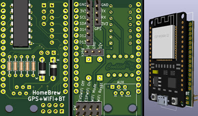
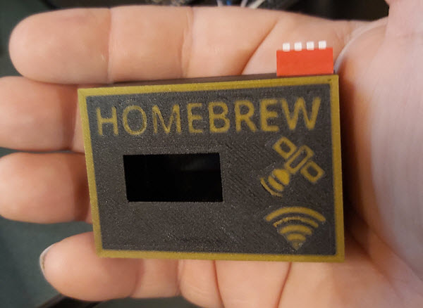
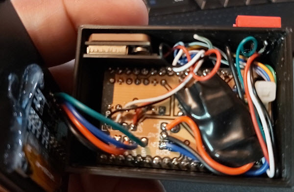
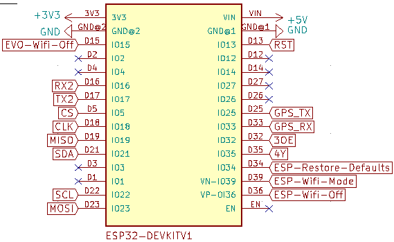

# Homebrew_GPS-WiFi-BT_AUX

# Pinout for v2.0

#### Added 4K7 pullup resistors on SDA and SCL

#### Pin changes

D4 (ESP Wifi Off) changed to D36

D5 (ESP Wifi Mode) changed to D39

D18 (ESP Restore Defaults) changed to D34

GPS_RX changed to D33

GPS_TX changed to D25

#### I2C pins: SDA (D21), SCL (D22)

#### SPI pins: CS (D5), CLK (D18), MISO (D19), MOSI (D23), RST (D13)

# Shared project on OshPark (PCB v2.0)
https://oshpark.com/shared_projects/jyQbF7Wx

## 3D Printing box design
https://www.thingiverse.com/thing:4806408

https://www.tinkercad.com/things/dk77gXFjQE0-homebrewgps-wifi-btaux

